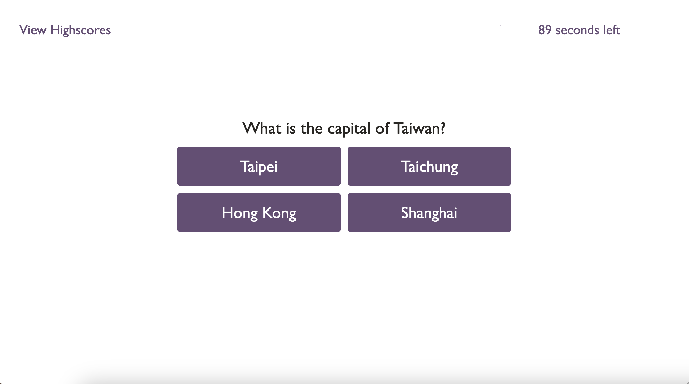
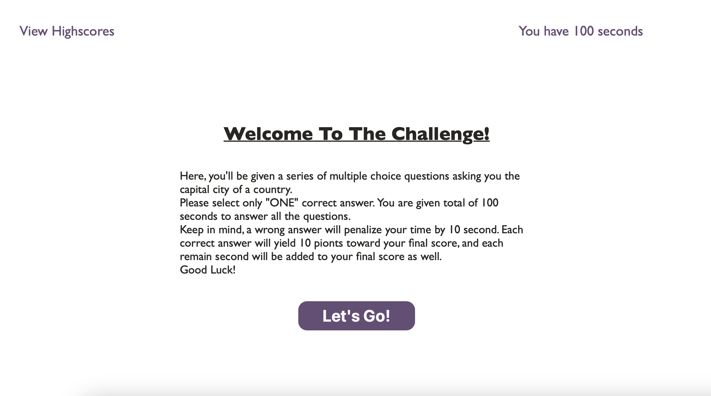

# TimedQuiz

Working as an individual to create a timed quiz.

- As a developer, I want to create a timed quiz to JavaScript fundamentals that stores high scores

## Acceptance Criteria

- It is done when users click on the start button, the timer starts and the first question is presented.
- It is done when time is subtracted from the clock.
- It is done when the next question is presented when users answer the current one.
- It is done when a question is answered incorrectly, the users are presented with another question.
- It is done when all questions are answered or when the timer reaches 0, the quiz is over.
- It is done when users’ score are presented after the quiz ends.
- It is done when users are given the choice to save their initials and score after the quiz ends.

## Assets

The following link is to the website for quiz.
https://jenryt.github.io/TimedQuiz/

The following images are some snapshots of the site.

